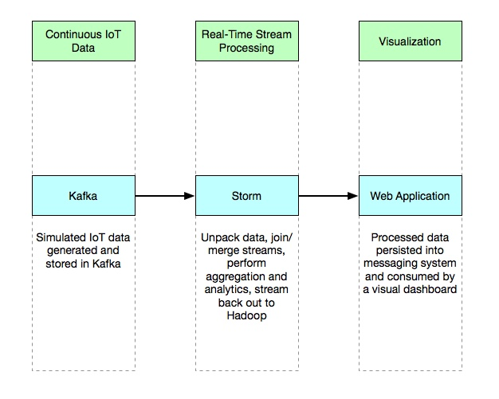

# Trucking IoT Use Case

## Outline

-   [The IoT Use Case](#the-iot-use-case)
-   [Architectural Overview](#architectural-overview)
-   [What is Storm](#what-is-storm)
-   [Benefits of Storm](#benefits-of-storm)
-   [Next: Storm in Action](#next:-storm-in-action)

## The IoT Use Case

Imagine a trucking company that dispatches trucks across the country.  The trucks are outfitted with sensors that collect data - data like the name of the driver, the route the truck is bound for, the speed of the truck, and even what event recently occured (speeding, the truck weaving out of its lane, following too closely, etc).  Data like this is generated very often, say once per second and is streamed back to the company's servers.

Additionally, the company is also polling an internet service for information about traffic congestion on the different trucking routes.

The company needs a way to process both of these streams of data and combine them in such a way that data from the truck is combined with the most up-to-date congestion data.  Additionally, they want to run some analysis on the data so that it can make sure trucks are traveling on time but also keeping cargo safe.  Oh, and this also needs to be done in real-time!

Why real-time?  The trucking company benefits by having a system in place that injests data from multiple sources, correlates these independant sources of data, runs analysis and intelligently reports on important events going on and even actions that the company can do to immediately improve the situation.  This even includes catching imminent truck breakdowns before they occur and analyzing driving habits to predit accidents before the driver gets into one!

Sounds like an important task - this is where Storm comes in.

## Architectural Overview

At a high level, our data pipeline requirement looks like the following.

In the first section, continous and real-time data from sensors onboard each truck is streamed to the system in real-time and published to Kafka topics.  A separate, second, stream carrying traffic congestion information about trucking routes is also streamed into the system and stored in a Kafka topic.

The second section represents the biggest requirement.  We need something capable of: unpacking the compressed and serialized sensor data, merging independant streams together, performing aggregation and analytics, reserializing the transformed data, and sending streams back out for persistance and visualization.  All this should be done in real-time and in distributed fashion while guaranteeing message processing and low-latency.

For these critical tasks we use Apache Storm.

The third section represents the post-ETL process, in this case being visualizing the processed data by a web application.

## What is Storm

[Apache Storm](https://hortonworks.com/apache/storm) is a free and open source data processing engine.  It can process and act on massive volumes of data in real-time, performing virtually any type of operation or computation as data flows through its components.

Storm exposes a set of components for doing real-time computation. Like how MapReduce greatly eases the writing of parallel batch processing, Storm's components greatly ease the writing of parallel, real-time computation.

Storm can be used for processing messages and updating databases (stream processing), doing a continuous query on data streams and streaming the results into clients (continuous computation), parallelizing an intense query like a search query on the fly (distributed RPC), and more.

## Benefits of Storm

-   **Broad set of use cases**:  Storm's small set of primitives satisfy a stunning number of use cases.  From processing messages and updating databases to doing continuous query and computation on datastreams to parallelizing a traditionally resource-intensive job like search queries.
-   **Scalable**: Storm scales to handle massive numbers of messages per second.  To scale a topology, one can add machines to the cluster or increase the number of parallel threads spawned by Storm.
-   **Guarantee no data loss**: Real-time systems must have strong guarantees about data being processed successfully and not allow data to be lost.  Storm guarantees processing of every message.
-   **Robust**: It is an explicit goal of the Storm project to make the user experience of managing Storm clusters as painless as possible.  This is in contract to other systems that are difficult to manage and deploy, especially in secured environments.
-   **Fault-tolerant**: Storm makes sure that a computation can run forever, resassigning tasks as necessary if something in the system fails.
-   **Development language agnostic**: Storm jobs and components can be defined in any language, making Storm accessible to nearly any developer.

## Next: Storm in Action

Now that we've got a high-level overview of what our use case looks like, let's move on to seeing this use case and our solution in an actual running demo application.
