# Lab 4：Spackでリスクファクタを算出しよう

注：このチュートリアルは任意で，Lab 3と同様の結果が得られます．必要に応じて，次のチュートリアルに進んでください．

## はじめに

このチュートリアルではApache Sparkを紹介します．このチュートリアルの最初のセクションでは，HDFSにデータを読み込ませ，Hiveを利用してデータを操作する方法を学びました．トラックのセンサデータを利用して，全てのドライバに関連するリスクをより理解できるようになりました．このセクションではApache Sparkを利用してリスクを計算する方法を説明します．

## 前提条件

このチュートリアルは，Hortonworks Sandboxを利用して，HDPに入門するための一連のチュートリアルの一部です．このチュートリアルを進める前に，以下の条件を満たしていることを確認してください．

- Hortonworks Sandbox
- [Hortonworks Sandboxの使い方を学習している](https://hortonworks.com/hadoop-tutorial/learning-the-ropes-of-the-hortonworks-sandbox/)
- Lab 1：センサデータをHDFSに読み込ませよう
- Lab 2：Hiveでデータ操作をしよう
- このチュートリアルを完了するのに1時間ほど掛かります．

## 概要
- [背景](#backdrop)
- [Apache Sparkの基本](#spark-basics)
- [Step 4.1：Ambariを使ってSparkサービスを設定する](#step4.1)
- [Step 4.2：Hive Contextを作成する](#step4.2)
- [Step 4.3：Hive ContextからRDDを作成する](@step4.3)
- [Step 4.4：テーブルに対するクエリ](#step4.4)
- [Step 4.5：ORCとしてHiveにデータを読み込み，保存する](#step4.5)
- [Sparkコードレビュー](#code-review)
- [まとめ](#summary)
- [参考文献](#further-reading)
- [付録A：SparkインタラクティブシェルでSparkを実行する](#appendix)

## 背景 <a id="backdrop"></a>

MapReduceは便利ですが，ジョブの実行時間がとても長くなることがあります．またMapReduceジョブは，特定のユースケースに対してのみ機能します．より多くのユースケースに対応できるフレームワークが必要です．

Apache Sparkは，高速で汎用性の高く使いやすいプラットフォームとして，設計されています．これはMapReduceモデルを拡張し，他全体のレベルに引き上げます．メモリ内で計算するため，処理と応答の処理を大幅に高速化しています．


## Apache Sparkの基本 <a id="spark-basics"></a>

Apache Sparkは，ScalaやJava，PythonおよびRのエレガントで表現力豊かな開発APIを備えた高速メモリ内データ処理エンジンであり，データワーカに迅速な反復アクセスが必要な機械学習アルゴリズムを効率的に実行できます．Spark on Apache Hadoop YARNは，企業内のHadoopや他のYARN対応ワークロードとの結合を可能にします．

Sparkでは，MapReduce型ジョブや反復アルゴリズムなどのバッチアプリケーションを実行します．インタラクティブなクエリを実行し，アプリケーションでストリーミングデータを処理することもできます．Sparkには，機械学習アルゴリズムやSQL，ストリーミング，グラフ処理などを簡単に利用できるライブラリも用意されています．Sparkは，Hadoop YARNやApache MososなどのHadoopクラスタ，または独自のスケジューラを利用するスタンドアロンモードでも動作します．Sandboxには，Spark 1.6とSpark 2.0の両方が含まれています．


それでは始めましょう！


## Step 4.1：Ambariを使ってSparkサービスを設定する <a id="step4.1"></a>
1. Ambari Dashboardに`maria_dev`としてログオンします．サービスの列の左下にあるSparkとZeppelinが動作していることを確認します．これらのサービスが無効になっている場合は，サービスを開始してください．
  
	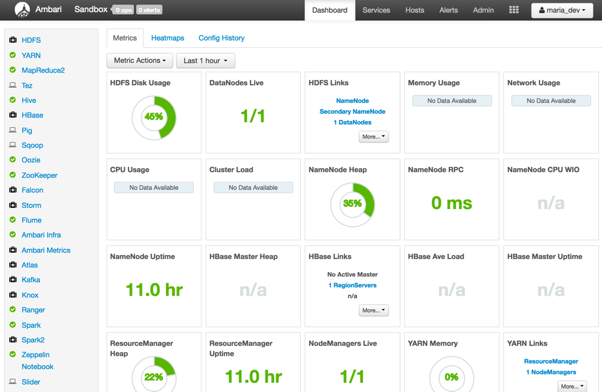
  
2. ブラウザにURLを入力して，Zeppelinインターフェースを開いてください
    
	```
	http://sandbox.hortonworks.com:9995
	```

    ZeppelinのWelcomeページが表示されるはずです．

    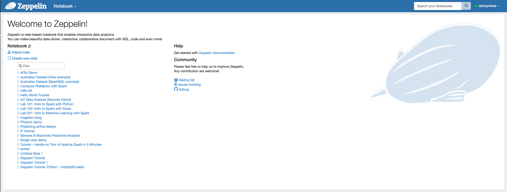

    任意で，Sparkでコードを実行するためにSparkシェルにアクセスしたい場合は付録Aを参照してください．
  
3. Zeppelin Notebookを作成する
    
    左上のNotebookタブをクリックし，Create new noteを選択してください．ノートブックの名前を`Compute Riskfactor with Spark`に設定します．
	
    
	
	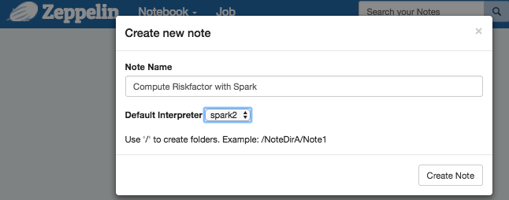

## Step 4.2：Hive Contextを作成する <a id="step4.2"></a>

SparkはORCファイルをサポートしています．ORCファイルによって効率的なカラムストレージとPredicate Pushdown機能を活用して，より高速なメモリ内処理が可能になります．HiveContextは，Hiveに格納されているデータと統合するSpark SQL実行エンジンのインスタンスです．より基本的なSQLContextは，Hiveに依存しないSpark SQLサポートのサブセットを提供します．HiveContextは，クラスパス上のhive-site.xmlからHiveの設定を読み込みます．

**SQLライブラリをインポートする**

Pigセクションを終えている場合は，Sparkを利用してテーブルのリスクファクタを再設定できるように，テーブルのリスクファクタを削除する必要があります．Zeppelinノートブークに次のコードを貼り付けてから，再生ボタンをクリックします．または，Shift + Enterを押してコードを実行します．

```
%jdbc(hive) show tables
```

`riskfactor`という名前のテーブルが既に存在する場合は，それを削除してください．

```
%jdbc(hive) drop table riskfactor
```

テーブルが削除されたことを確認するには，再度テーブルを表示させてください．

```
%jdbc(hive) show tables
```

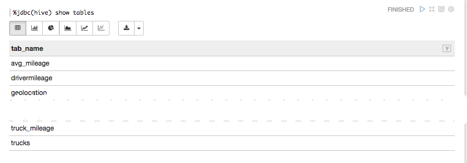

**SparkSessionをインスタンス化する**

```
%spark2
val hiveContext = new org.apache.spark.sql.SparkSession.Builder().getOrCreate()
```

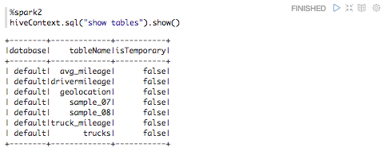


## Step 4.3：Hive ContextからRDDを作成する <a id="step4.3"></a>

**What is a RDD?**

Sparkの主要なコア部分は，Resilent Distributed Dataset，またはRDDと呼ばれます．これは，クラスタ全体で並列化された要素の分散コレクションです．言い換えると，RDDはYARNクラスタの複数の物理ノードに分割，分散され，並列に操作できるオブジェクトの不変な集合体です．

RDDを作成する方法は3つあります．

- 既存のコレクションを並列化します．これはデータが既にSpark内に存在し，並列で操作できることを意味します．
- データセットを参照してRDDを作成します．このデータセットは，HDFSやCassandra，HBaseなどのHadoopでサポートされている全てのストレージソースから取得できます．
- 既存のRDDを変換して，新しいRDDを作成します．

チュートリアルでは後半の2つの方法を利用します．

**RDDのTransformationsとActions**

通常，RDDは共有ファイルシステムやHDFS，HBase，YARNクラスタ上のHadoop InputFormatを提供するデータソースからデータを読み込むことによってインスタンス化されます．

RDDがインスタンス化されると，一連の操作を適用することができます．全ての操作は，[Transformations](https://spark.apache.org/docs/1.2.0/programming-guide.html#transformations)または[Actions](https://spark.apache.org/docs/1.2.0/programming-guide.html#actions)の2つのタイプのいずれかに分類されます．


- 変換操作では，既存のRDDから新しいデータセットを作成し，DAG処理を構築します．DAG処理は，YARNクラスタ全体でパーティションデータセットに適用できます．変換操作は値を返しません．実際にはこれらの変換ステートメントの定義中に評価されるものはありません．Sparkは，これらのDAGを作成します．これは実行時にのみ評価されます．これをlazyな評価と呼びます．
- 一方Action操作はDAGを実行し，値を返します．

**Step 4.3.1：Hive Warehouseのテーブル一覧を表示する**

Hiveウェアハウス内のテーブルのリストを表示するには，単純にshowコマンドを利用します．

```
%spark2
hiveContext.sql("show tables").show()
```


既にチュートリアルで作成した`geolocation`テーブルと`drivermileage`テーブルはHiveメタストアにリストされており，直接クエリが可能です．

**Step 4.3.2：Spark RDDを構築するためのクエリテーブル**

`geolocation`と`drivermileage`テーブルからspark変数にデータをフェッチする簡単なselectクエリを実行します．この方法でSparkからデータを取得すると，テーブルスキーマにRDDをコピーすることもできます．

```
%spark2
val geolocation_temp1 = hiveContext.sql("select * from geolocation")
```


## Step 4.4：テーブルに対するクエリ  <a id="step4.4"></a>

**Step 4.4.1：一時テーブルの登録**

次に，一時テーブルを登録し，SQL構文を利用して，そのテーブルに対してクエリを実行しましょう．

```
%spark2
geolocation_temp1.createOrReplaceTempView("geolocation_temp1")
drivermileage_temp1.createOrReplaceTempView("drivermileage_temp1")
hiveContext.sql("show tables").show()
```

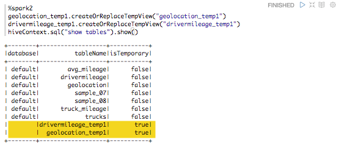

次にイテレーションとフィルタ操作を行います．まず，正常ではないイベントを持つドライバをフィルタリングし，各ドライバの非正常イベントの数をカウントする必要があります．

```
%spark2
val geolocation_temp2 = hiveContext.sql("SELECT driverid, count(driverid) occurance from geolocation_temp1 where event!='normal' group by driverid")
```


- 前にRDD変換について述べたように，select操作はRDD変換であるため，何も返ってきません．
- 結果の表は，各ドライバに関連付けられた正常ではないイベントの合計がカウントされます．このフィルタリングされたテーブルを一時テーブルとして登録し，後のSQLクエリをそのテーブルに適用できるようにします．

```
%spark2
geolocation_temp2.createOrReplaceTempView("geolocation_temp2")
hiveContext.sql("show tables").show()
```

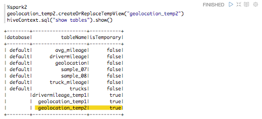


- RDDでaction操作を実行すると，結果を表示できます．

```
%spark2
geolocation_temp2.show(10)
```

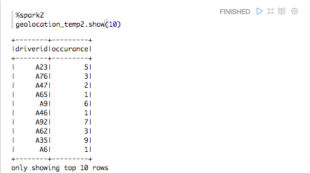

**Step 4.4.2：join操作の実行**

このセクションでは，join操作を実行します．geolocation_temp2テーブルには，ドライバの詳細とそれぞれ正常ではないイベントがカウントされています．drivermileage_temp1テーブルには，各ドライバの移動距離の合計が表示されます．


- 共通のカラムで2つの表を結合します．この例ではdriveridです．


```
%spark2
val joined = hiveContext.sql("select a.driverid,a.occurance,b.totmiles from geolocation_temp2 a,drivermileage_temp1 b where a.driverid=b.driverid")
```


- 得られるデータセットは，特定のドライバの合計マイル数と非正常なイベントの総数です．．このフィルタリングされたテーブルを一時テーブルとして登録し，後続のSQLクエリをそのテーブルに適用できるようにします．

```
%spark2
joined.createOrReplaceTempView("joined")
hiveContext.sql("show tables").show()
```

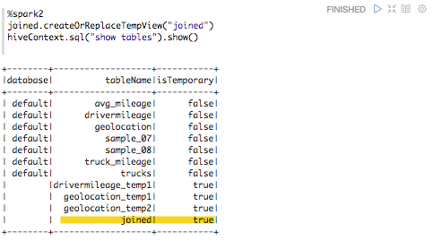


- RDDでaction操作を実行して，結果を表示できます．

```
%spark2
joined.show(10)
 ```

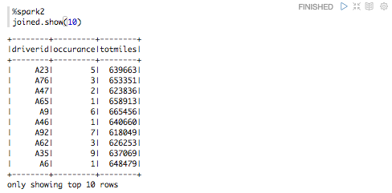

**Step 4.4.3：ドライバのリスクファクタを計算する**

このセクションでは，ドライバのリスクファクタを全てのドライバに関連付けます．ドライバのリスクファクタは，正常ではない事故の発生総数を除算することで計算できます．

```
%spark2
val risk_factor_spark = hiveContext.sql("select driverid, occurance, totmiles, totmiles/occurance riskfactor from joined")
```


- 得られるデータセットは合計マイル数と非正常イベントの総数，特定のドライバのリスクファクタです．このフィルタリングされたテーブルを一時テーブルとして登録し，後のSQLクエリをそのテーブルに適用できるようにします．

```
%spark2
risk_factor_spark.createOrReplaceTempView("risk_factor_spark")
hiveContext.sql("show tables").show()
```

- 結果を表示します

```
%spark2
risk_factor_spark.show(10)
```

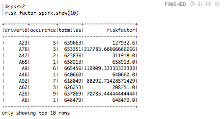


## Step 4.5：ORCとしてHiveにデータを読み込み，保存する <a id="step4.5"></a>

このセクションでは，Sparkを利用してORC（Optimized Row Columnar）形式でデータを格納します．ORCは，Hadoopワークロード用に設計された自己記述型認識カラム形式です．これは大規模なストリーミングの読み込みと，必要な行を素早く見つけるための統合サポートに最適化されています．データをカラム形式で保存すると，リーダーは現在の必要な値だけ読み，解凍，処理することができます．ORCファイルはタイプを認識しているため，ライターはそのタイプに最も適したエンコーディングを選択し，ファイルが永続化されるときに内部インデックスを利用します．

Predicate Pushdownでは，これらの索引を利用して特定のクエリに対してファイルのどこを読み込む必要があるかを判断し，行索引によって検索を10,000行の特定の集合に絞り込むことができます．ORCは，構造体やリスト，マップおよび共用体の複合型を含むHiveの完全な型セットをサポートしています．

**Step 4.5.1：ORCテーブルを作成する**

テーブルを作成し，ORCとして格納します．次のSQL文の最後に`orc`を指定すると，HiveテーブルがORC形式で格納されます．

```
%spark2
hiveContext.sql("create table finalresults( driverid String, occurance bigint, totmiles bigint, riskfactor double) stored as orc").toDF()
hiveContext.sql("show tables").show()
```

注：toDF()は，列driveid Stringやoccurrence brightなどでDataFrameを作成します．

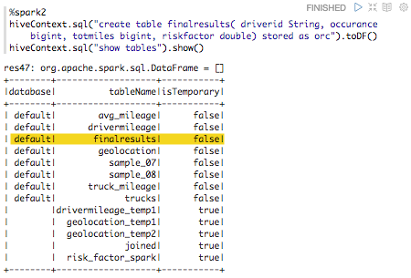

**Step 4.5.2：ORCテーブルにデータを変換する**

上記で作成したHiveテーブルにデータを読み込む前に，データファイルをORC形式に変換する必要があります．

```
%spark2
risk_factor_spark.write.format("orc").save("risk_factor_spark")
```


**Step 4.5.3：load dataコマンドを利用して，Hiveテーブルにデータを読み込む**

```
%spark2
hiveContext.sql("load data inpath 'risk_factor_spark' into table finalresults")
```


**Step 4.5.4：CTASを利用して，Riskfactorテーブルを作成する**

```
%spark
hiveContext.sql("create table riskfactor as select * from finalresults").toDF()
```


**Step 4.5.5：データが正常にHiveに格納されたことを確認する**

selectクエリを実行して，テーブルが正常に格納されたことを確認します．Ambari Hive User Viewを利用して，作成したHiveテーブルにデータが格納されているかどうかを確認できます．

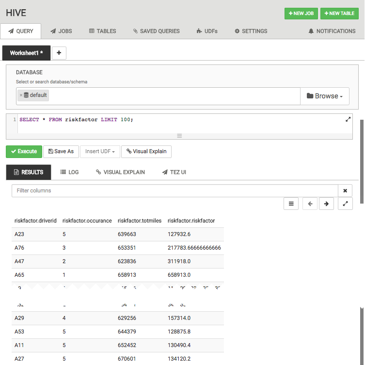


## Sparkコードレビュー <a id="code-review"></a>

**SparkSessionをインスタンス化**

```
%spark2
val hiveContext = new org.apache.spark.sql.SparkSession.Builder().getOrCreate()
```

**デフォルトのHiveデータベースにテーブルを表示**

```
hiveContext.sql("show tables").show()
```

**テーブルから全ての行と列を選択，Hiveスクリプトを変数に格納し，変数をRDDとして登録**

```
val geolocation_temp1 = hiveContext.sql("select * from geolocation")
val drivermileage_temp1 = hiveContext.sql("select * from drivermileage")
geolocation_temp1.createOrReplaceTempView("geolocation_temp1")
drivermileage_temp1.createOrReplaceTempView("drivermileage_temp1")
val geolocation_temp2 = hiveContext.sql("SELECT driverid, count(driverid) occurance from geolocation_temp1 where event!='normal' group by driverid")    
geolocation_temp2.createOrReplaceTempView("geolocation_temp2")
```

**geolocation_temp2からdrivermileageテーブルの最初の10行のデータを読み込む**

```
geolocation_temp2.show(10)
```

**同じドライバIDで2つのテーブルを結合して作成，，RDDとして結合して登録**

```
val joined = hiveContext.sql("select a.driverid,a.occurance,b.totmiles from geolocation_temp2 a,drivermileage_temp1 b where a.driverid=b.driverid")
joined.createOrReplaceTempView("joined")
```

**最初の10行と列を結合して読み込む**

```
joined.show(10)
```

**risk_factor_sparkを初期化し，RDDとして登録**

```
val risk_factor_spark = hiveContext.sql("select driverid, occurance, totmiles, totmiles/occurance riskfactor from joined") 
risk_factor_spark.createOrReplaceTempView("risk_factor_spark")
```

**risk_factor_sparkテーブルから最初の10行を出力**

```
risk_factor_spark.show(10)
```

**Hiveでfinalresultsテーブルを作成し，ORCとして保存．データを読み込んでからCTASを利用してriskfactorテーブルを作成します．**

```
hiveContext.sql("create table finalresults( driverid String, occurance bigint, totmiles bigint, riskfactor double) stored as orc").toDF()
risk_factor_spark.write.format("orc").save("risk_factor_spark")
hiveContext.sql("load data inpath 'risk_factor_spark' into table finalresults")
hiveContext.sql("create table riskfactor as select * from finalresults").toDF()
```


## まとめ <a id="summary"></a>

おめでとうございます！全てのドライバに関するリスクファクタを算出するために学んだSparkコーディングスキルと知識をまとめましょう．Apache Sparkは，メモリ内データ処理エンジンなので効率的です．Hive Contextを作成することで，HiveとSparkを統合する方法を学びました．既存のHiveデータを利用して，RDDを作成しました．また既存のRDDから新しいデータセットを作成するためにRDDのTransrationsとActionについてに学びました．これらの新しいデータセットはフィルタリング，操作，処理されたデータが含まれています．リスクファクタを計算した後に，データをHiveに読み込ませ，ORCとして保存する方法を学びました．

## 参考文献 <a id=further-reading"></a>

Sparkの詳細については，以下の資料を参照してください．

- [Apache Spark](https://hortonworks.com/hadoop/spark/)
- [Apache Spark Welcome](http://spark.apache.org/)
- [Spark Programming Guide](http://spark.apache.org/docs/latest/programming-guide.html#passing-functions-to-spark)
- [Learning Spark](http://www.amazon.com/Learning-Spark-Lightning-Fast-Data-Analysis/dp/1449358624/ref=sr_1_1?ie=UTF8&qid=1456010684&sr=8-1&keywords=apache+spark)
- [Advanced Analytics with Spark](http://www.amazon.com/Advanced-Analytics-Spark-Patterns-Learning/dp/1491912766/ref=pd_bxgy_14_img_2?ie=UTF8&refRID=19EGG68CJ0NTNE9RQ2VX)


## 付録A：SparkインタラクティブシェルでSparkを実行する <a id="appendix"></a>

ターミナルまたはPuttyを開きます．SSHでSandboxに入ります．ユーザは`root`で，パスワードは`hadoop`です．

```
ssh root@sandbox.hortonworks.com -p 2222
login: root
password: hadoop
```

任意で，SSHクライアントをインストールおよび設定をしていない場合は，次のURLからアクセスできる組み込みWebクライアントを利用してください．

```
http://sandbox.hortonworks.com:4200/
login: root
password: hadoop
```

Sparkのインタラクティブシェル（spark repl）に入りましょう．次のコマンドを入力してください．

```
spark-shell
```

これで，デフォルトのSpark Scala APIが読み込まれます．`exit`コマンドを実行すると，Spark Shellを終了できます．

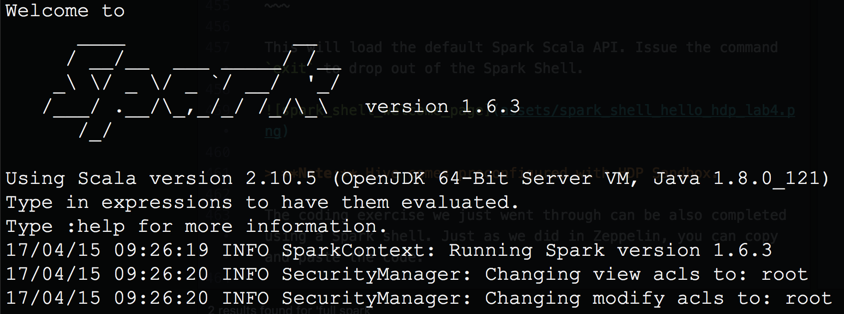

Spark Shellを利用してコーディングをすることも可能です．Zeppelinのようにコードをコピー＆ペーストすることもできます．

