# Deploying Hortonworks Sandbox on Microsoft Azure

## Introduction

The Azure cloud infrastructure has become a common place for users to deploy virtual machines on the cloud due to its flexibility, ease of deployment, and cost benefits.  Microsoft has expanded Azure to include a marketplace with thousands of certified, open source, and community software applications and developer services, pre-configured for Microsoft Azure.  This tutorial covers deploying the Hortonworks Sandbox offering via the Azure Marketplace.

## Prerequisites

-   [A Microsoft Azure account. You can sign up for an evaluation account if you do not already have one.](https://azure.microsoft.com/en-us/free/)

## Outline

-   [Find Hortonworks Sandbox on Azure Marketplace](#find-hortonworks-sandbox-on-azure-marketplace)
-   [Creating the Sandbox](#creating-the-sandbox)
-   [Set a Static IP](#set-a-static-ip)
-   [Configure SSH Tunneling](#configure-ssh-tunneling)
    -   [Using SSH](#using-ssh)
    -   [Using PuTTY](#using-putty)
-   [Splash Screen](#splash-screen)
-   [Summary](#summary)
-   [Further Reading](#further-reading)

## Find Hortonworks Sandbox on Azure Marketplace

Go to [Microsoft Azure Marketplace](https://azuremarketplace.microsoft.com/en-us/marketplace) and enter "Hortonworks" into the search bar.  Submit, and the **Hortonworks Sandbox** product should appear as shown in this screenshot.

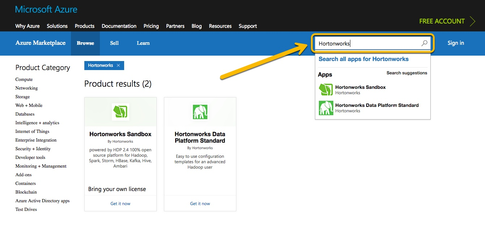

Select the Hortonworks Sandbox product and its Overview will display.  Click on **Get It Now** to start the setup process.

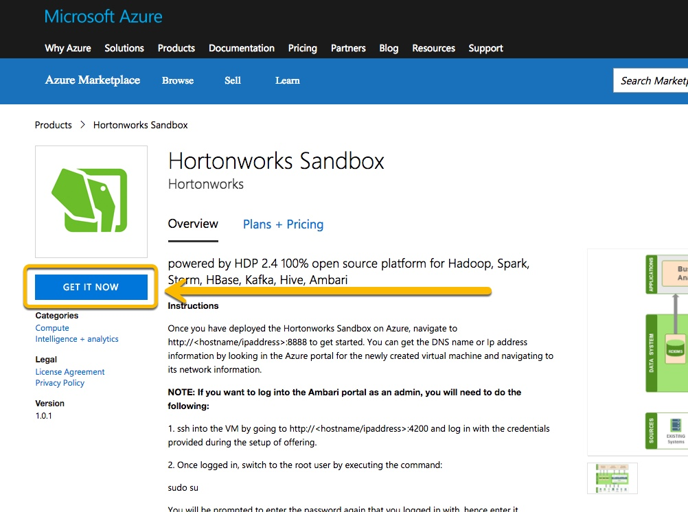

If prompted, sign in to Azure Marketplace.  Afterward, you'll be asked to confirm your selection, as shown below.

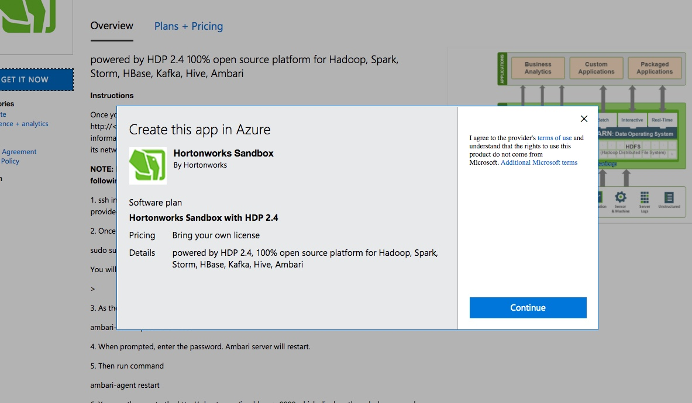

## Creating the Sandbox

An explanation of the Hortonworks Sandbox will come on the screen.  When ready to begin the deployment process, select **Create** from the bottom of the screen.

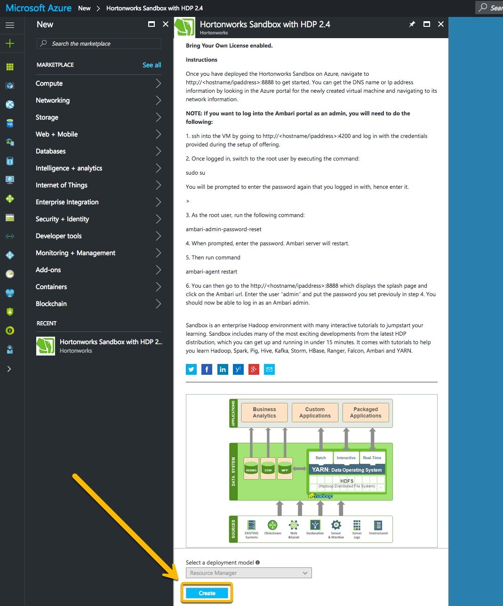

Fill out some basic sandbox configuration settings.  Scroll down for an explanation of the different fields.

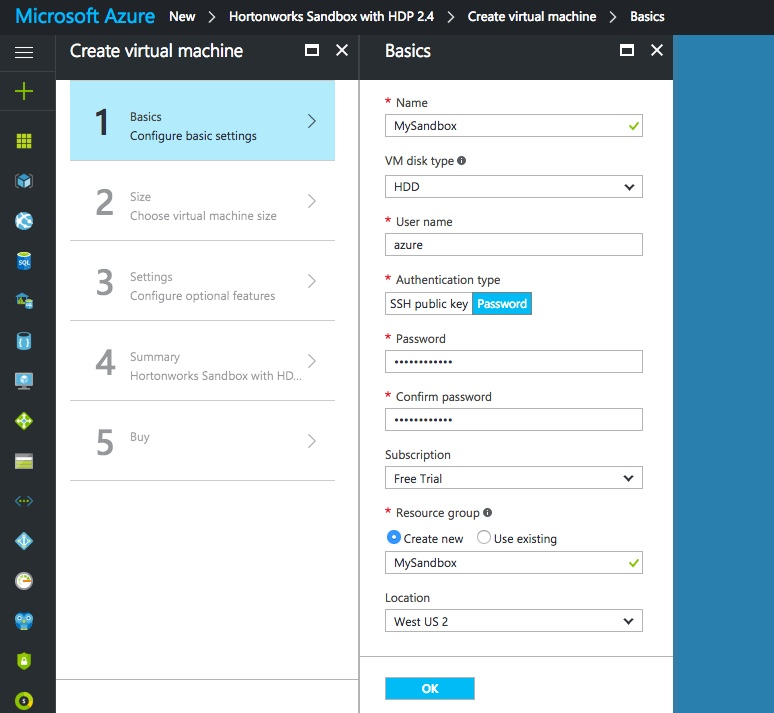

The different fields:
-   **Name**: This is the name you want to use to reference the machine.  In the example above, we use the name "MySandbox"
-   **User name**: The name of the user account that will be used to log into the machine.  Throughout these tutorials, we will use azure as the user name.
-   **Authentication type**: By default, the machine will be deployed and allow you to connect via SSH key or password.  In this example, we opt to use a password.
-   **Subscription**: The subscription to deploy the machine under.  Select one already in your list.
-   **Resource group**: The name of the resource group to create, or use an existing one.  Here, we create a new one with the same name as the machine itself.
-   **Location**: Which region in the Azure offering to deploy the machine to.

> Note: Make sure to write down or remember your username and password.  If using SSH, ensure you have the corresponding private key.  Otherwise, you will not be able to log in to the machine.

The next step is to choose a size for the virtual machine.  It is recommended to use a machine with A4 specifications, or higher.

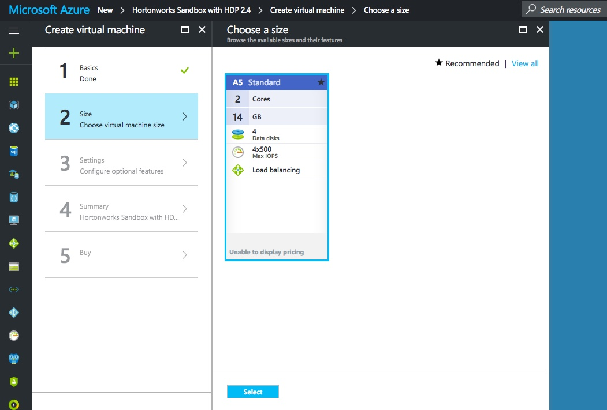

Optional settings to configure.  You can safely leave these at their defaults.

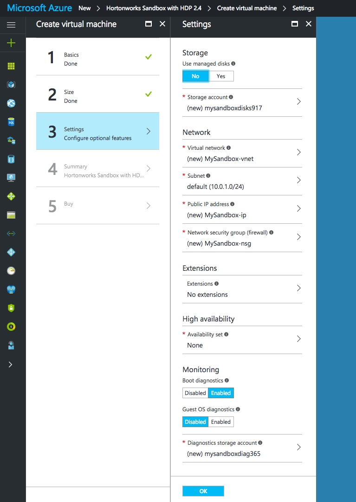

Look over the summary and continue when ready.

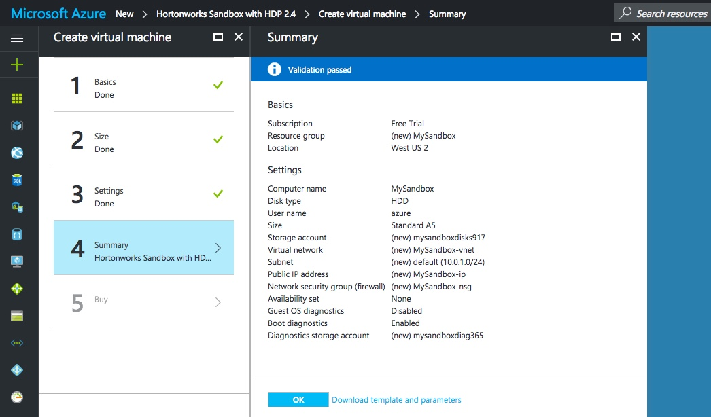

Alright, we're ready to deploy!  Review the offer details and purchase when ready.

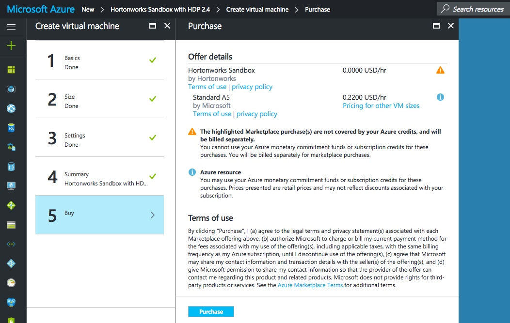

Once the offer is submitted by selecting **Purchase**, the sandbox will take a few minutes to set up and deploy.  After deployment is complete, we can move on to connecting to the sandbox.

## Set a Static IP

Once the machine is deployed, it's overview will appear on the screen.  Find the sandbox's public IP address and click on it.

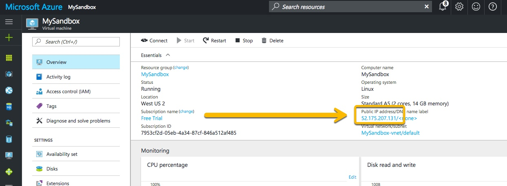

Clicking on the IP address will bring up the IP configuration panel.  Select **Static** as the Assignment, and then make sure to save your changes.  This will keep the sandbox from changing IP addresses each time it's rebooted.

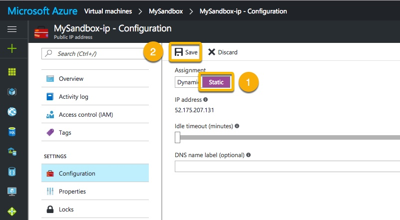

## Configure SSH Tunneling

SSH tunneling allows us a way to port forward securely, without actually opening the machine's ports for the entire world to access.  Follow these steps to access the endpoints of your Azure deployment from your computer.

### Using SSH

Use your favorite editor and edit your `~/.ssh/config` file.  For example:
```
vi ~/.ssh/config
```

Enter the following configuration, replacing the **HostName** IP with the public IP of your instance.  More forwardings can be entered via the **LocalForward** directive similar to the ones displayed here.

> Note: Spacing and capitalization is important.

```
Host azureSandbox (or any other host alias)
  Port 22
  User <your-specified-azure-username-here>
  HostName <your-azure-public-ip-here>
  LocalForward 8080 127.0.0.1:8080
  LocalForward 8888 127.0.0.1:8888
  LocalForward 9995 127.0.0.1:9995
  LocalForward 9996 127.0.0.1:9996
  LocalForward 8886 127.0.0.1:8886
  LocalForward 10500 127.0.0.1:10500
  LocalForward 4200 127.0.0.1:4200
  LocalForward 2222 127.0.0.1:2222
```

Save and close the file.  Now SSH into the Azure machine by using the **Host** alias we just created, by using the command below.  This will connect automatically using the IP address specified in the config file.

```
ssh azureSandbox
```

You'll be asked for a password, which is the one you set during initial configuration on Azure.

That's it!  Keep this SSH connection open for the duration of your interaction with the sandbox on Azure.

### Using PuTTY

Open PuTTY.  A window titled "**PuTTY Configuration**" will open.  In the left sidebar, navigate to "**Connection > SSH > Tunnels**" as shown in the picture below.

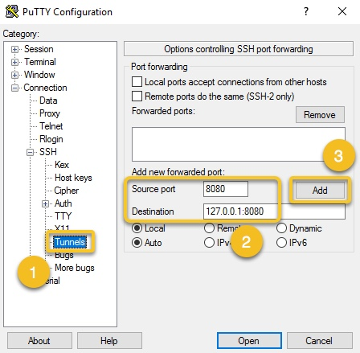

We want to add a forwarded port.  In the "**Source port**" field, enter `8080`.  In the "**Destination**" field, enter `127.0.0.1:8080`.  Click on "**Add**" to add this port forward.  Do the same for the following common sandbox ports, plus any custom ones you would like.

```
8080 -> 127.0.0.1:8080
8888 -> 127.0.0.1:8888
9995 -> 127.0.0.1:9995
9996 -> 127.0.0.1:9996
8886 -> 127.0.0.1:8886
10500 -> 127.0.0.1:10500
4200 -> 127.0.0.1:4200
2222 -> 127.0.0.1:2222
```

Next, in the left sidebar, navigate to "**Session**" as shown in the picture below.

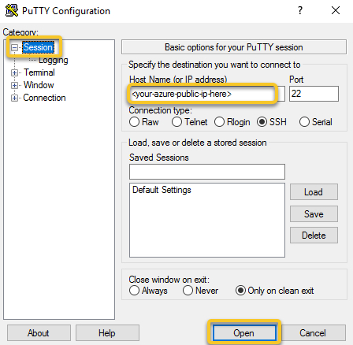

In the "**Host Name (or IP address)**" field, enter the Azure IP address from the previous section.  Make sure that the port is set to `22`.  Finally, click on "**Open**".

A login window opens.

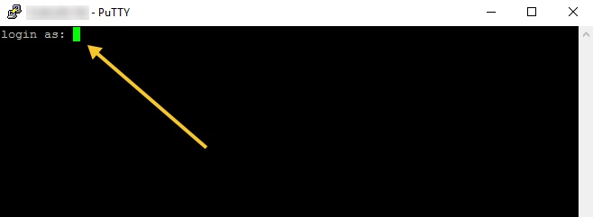

Enter the user name you specified during Azure deployment (in our case, we used the login `azure`).  You'll be asked for a password, which is also the password you specified during deployment.

## Splash Screen

Now that you've port forwarded by following the tutorial linked above, you can explore the sandbox as you see fit.  Point your browser to <http://localhost:8888> for the sandbox's splash screen.


Fill out the form and hit **Submit** to access the sandbox.

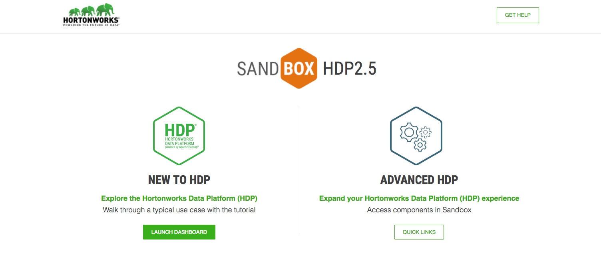

That's it!  Keep this SSH connection open for the duration of your interaction with the sandbox on Azure.

## Summary

You can now access all forwarded ports by pointing a browser to <http://localhost:portNumber>.  For example: <http://localhost:8888> will connect to the Azure machine and sandbox over port 8888.

SSH tunneling allows us a way to port forward securely, without actually opening the machine's ports for the entire world to access.

## Further Reading

Now that you've got HDP up and running, check out our other tutorials to learn how to leverage its power.

- [Learning the Ropes of the Hortonworks Sandbox](https://hortonworks.com/tutorial/learning-the-ropes-of-the-hortonworks-sandbox)
- [SSH Tunneling Explained](https://chamibuddhika.wordpress.com/2012/03/21/ssh-tunnelling-explained)
